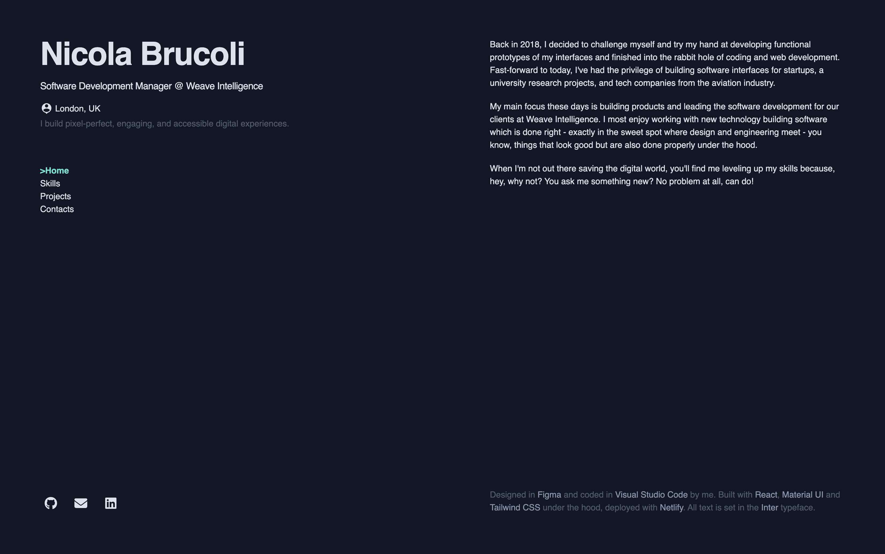

# Frontend Developer React Portfolio

    

Live link: https://nicola-dev.netlify.app/
 
1. [Intro](#Intro) 
2. [Description](#Description) 
3. [Installation](#Installation) 
4. [Usage](#Usage) 
5. [Preview](#Preview) 
6. [Contributing](#Contributing) 
7. [Tests](#Tests) 
8. [License](#License) 

## Intro
Frontend Dev React Portfolio: Stylish, concise frontend showcase with React, Tailwind, and Material-Tailwind. 

## Description
The following project consist in a frontend developer showcase developed using React, React Routers, Tailwind CSS, and Material-Tailwind. This portfolio creation tool utilises JSON files for a better content customisation, allowing users to define their skills, mark featured ones, list and manage project visibility (public or private). The integration of React Routers ensures an intuitive navigation experience, guiding visitors through various sections with ease. The portfolio's visual appeal is achieved through Tailwind CSS styling, complemented by Material-Tailwind for consistent UI elements. Users can input personal data, including their current position, full name, and more. Additionally, a contact form with React hooks ensures data integrity with conditional alerts, offering a comprehensive and engaging portfolio experience for frontend developers.
 

## Installation
1. Clone the repository
	`git clone https://github.com/sonictrain/nicola-brucoli-react-portfolio`

2. Move inside the repo directory
	`cd nicola-brucoli-react-portfolio`

3. Install dependencies using
	`npm install`
 

## Usage
Simply run the development Vite server with `npm run dev` or run the build with the following commands `npm run build` and then `npm run preview`.
 
## Preview
 

## Contributing
All contributions from the community aiming to enhance and improve this project are welcome. If you have ideas for new features, encounter bugs, or want to contribute in any other way, please feel free to open an issue or submit a pull request. We appreciate your support in making this README generator even more robust and user-friendly.
 

## Tests
As of now, there are no specific tests implemented for this README Generator. However, enhancing the testing infrastructure is a priority for future development. If you're interested in contributing to the testing efforts, please feel free to reach out.
 

## License
A short and simple permissive license with conditions only requiring preservation of copyright and license notices. Licensed works, modifications, and larger works may be distributed under different terms and without source code. 

---

Generate with [Better Readme](https://github.com/sonictrain/better-readme) Copyright (c) 2024, [Nicola Brucoli](https://github.com/sonictrain).